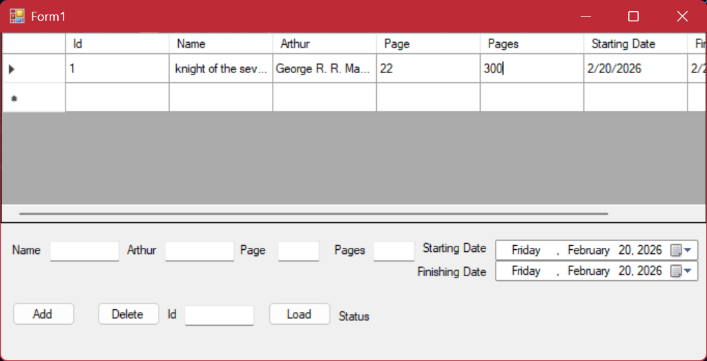


# MyLibrary

It's simple library app to keep track of all books you read or red.

#


## Features
- Load Button to load database/your library and edit it
- Add button you can add new book
- Delete button you can delete any book by inputing its id


## Installation

- clone repository
- run database.sql file in SQL Server Managment(if you dont have it install Microsoft SQL)
- Change server name 
```bash
  string connections = "Server=Your_server_name;Database=Mylibrary;Integrated Security=True";//input name of your server instead of Your_server_name
```

## Screenshots



